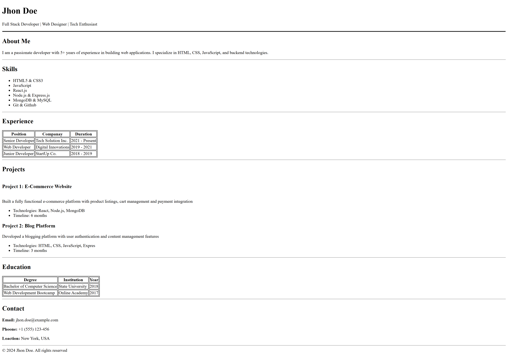

# 📄 Single-Page Resume Building — HTML Only

A clean, single-page resume website built using **pure HTML** — no CSS, no frameworks, no external libraries. This project was created as part of an assignment to demonstrate proper semantic HTML structure and layout.

---

## 📌 Assignment Brief

Build a single-page resume website in HTML that includes:

- Header with name and title
- About Me section
- Skills list
- Experience table
- Projects section
- Education table
- Contact details

**Constraint:** No CSS used. Structure and readability achieved purely through semantic HTML tags.

---

## 🗂️ Project Structure

```
resume/
│── assets/
|   └── screenshot.png
├── index.html
└── README.md
```

---

## 🧱 Sections Covered

| Section     | HTML Elements Used                           |
|-------------|----------------------------------------------|
| Header      | `<header>`, `<h1>`, `<p>`                    |
| About Me    | `<section>`, `<h2>`, `<p>`                   |
| Skills      | `<ul>`, `<li>`                               |
| Experience  | `<table>`, `<thead>`, `<tr>`, `<td>`, `<th>` |
| Projects    | `<h3>`, `<p>`, `<ul>`, `<li>`                |
| Education   | `<table>`, `<thead>`, `<tr>`, `<td>`, `<th>` |
| Contact     | `<p>`, `<b>`                                 |
| Footer      | `<footer>`                                   |

---

## 🚀 Setup & Usage

No build tools or dependencies required. Just open the file in a browser.

### Steps

1. **Clone the repository**
   ```bash
   git clone https://github.com/MDK528/resume.git
   ```

2. **Navigate into the project folder**
   ```bash
   cd resume
   ```

---

## 🖥️ Live Demo

> 🔗 [View Live Site](https://resume-cyan-chi.vercel.app/)

---

## 📸 Screenshot


---

## ✅ Key Highlights

- **No CSS** — layout achieved entirely with semantic HTML
- Proper use of `<table>` for experience and education sections
- Semantic sectioning with `<header>`, `<main>`, `<section>`, `<footer>`
- Clean, readable, and well-commented code structure
- `<hr>` used as a visual divider between sections

---

## 📝 Notes

- The data used in this resume is fictional/sample data for demonstration purposes
- The goal is to showcase HTML structure, not visual design
- `<b>` and `<hr>` are the only minor styling/emphasis tags used, which are standard HTML

---

## 👤 Author

**Md Khalid Hossain**  
GitHub: [MDK528](https://github.com/MDK528)
